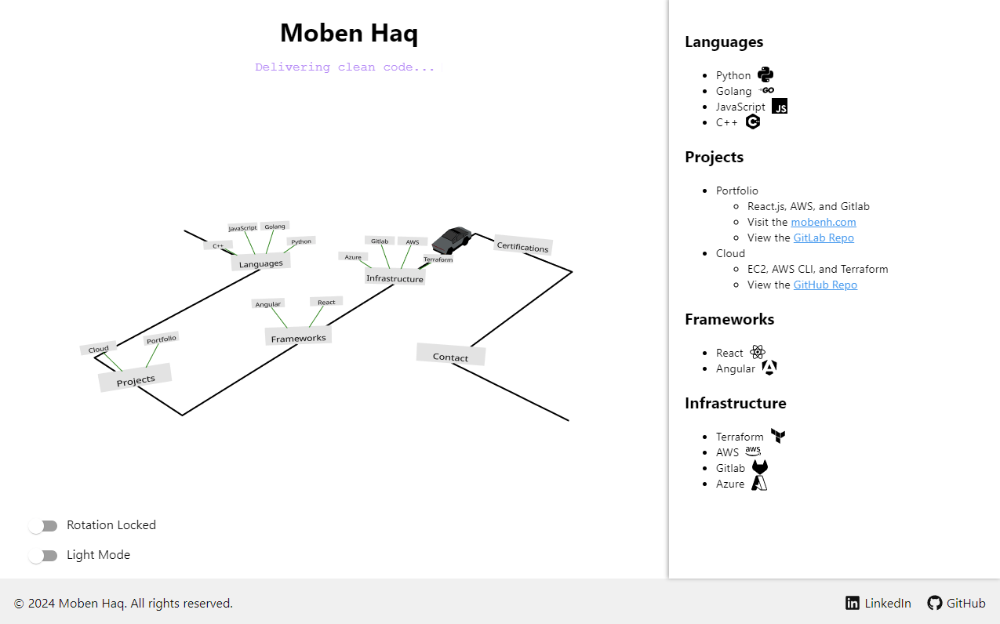

# Personal Portfolio Website - [mobenh.com](https://mobenh.com)

[](https://mobenh.com)
[](https://gitlab.com/mobenh/portfolio/pipelines)


## Description

Welcome to my personal portfolio website built with **React.js** and **Three.js**. This interactive platform showcases my projects, skills, certifications, and contact information through engaging 3D visualizations and animations.

The site is hosted on **AWS S3** and served via **CloudFront**, with domain management through **AWS Route 53** at [mobenh.com](https://mobenh.com). Continuous Integration and Deployment are automated using **GitLab CI/CD** configured via a `.gitlab-ci.yml` file.

## Features

- Interactive 3D visualizations using React Three Fiber and Three.js
- Responsive design optimized for both desktop and mobile
- Dark mode support
- Dynamic content rendering
- Contact information with quick access links
- Production-grade infrastructure using AWS services
- Automated CI/CD pipeline with GitLab

## Technologies Used

- **Frontend**: React.js, Three.js, React Three Fiber, React Spring, Material-UI
- **Deployment**: AWS S3, AWS CloudFront, AWS Route 53
- **CI/CD**: GitLab CI/CD
- **Version Control**: Hosted on both GitLab and GitHub
  - [GitLab Repository](https://gitlab.com/mobenh/portfolio) (with CI/CD configuration)
  - [GitHub Repository](https://github.com/mobenh/portfolio)
- **Analytics**: Google Analytics

## Installation

1. **Clone the Repository**

   ```bash
   # Clone from GitLab
   git clone https://gitlab.com/mobenh/portfolio.git
   # Or clone from GitHub
   git clone https://github.com/mobenh/portfolio.git
   ```

2. **Navigate, Install, and Run**

   ```bash
   cd portfolio
   npm install
   npm start
   ```
3. Access the app at [http://localhost:3000](http://localhost:3000).

## Deployment

The application is deployed using AWS services:

- **AWS S3**: Hosts the static files of the React application.
- **AWS CloudFront**: Serves as a CDN for faster global content delivery.
- **AWS Route 53**: Manages the domain and DNS routing.

## Continuous Integration and Deployment (CI/CD)

Automated using **GitLab CI/CD**:

- **`.gitlab-ci.yml`**: Defines the CI/CD pipeline, including build and deployment stages.
- **Pipeline**: On commits to the `main` branch, the pipeline builds and deploys the app to AWS S3.
- **AWS Credentials**: Stored securely as environment variables in GitLab CI/CD settings.

## Contact

Feel free to reach out for any questions or collaborations:

- **Email**: [moben.h@outlook.com](mailto:moben.h@outlook.com)
- **LinkedIn**: [linkedin.com/in/moben-haq](https://www.linkedin.com/in/moben-haq)
- **GitHub**: [github.com/mobenh](https://github.com/mobenh)
- **GitLab**: [gitlab.com/mobenh](https://gitlab.com/mobenh)

---

Thank you for visiting my portfolio!